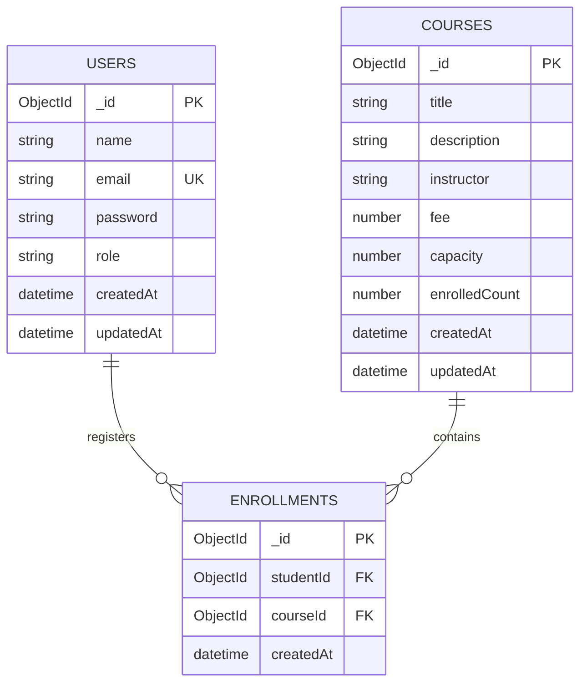

# Course Management System ERD

```mermaid
erDiagram
    USERS ||--o{ ENROLLMENTS : registers
    COURSES ||--o{ ENROLLMENTS : contains

    USERS {
        ObjectId _id PK
        string name
        string email UK
        string password
        string role
        datetime createdAt
        datetime updatedAt
    }

    COURSES {
        ObjectId _id PK
        string title
        string description
        string instructor
        number fee
        number capacity
        number enrolledCount
        datetime createdAt
        datetime updatedAt
    }

    ENROLLMENTS {
        ObjectId _id PK
        ObjectId studentId FK
        ObjectId courseId FK
        datetime createdAt
    }
```

The `(studentId, courseId)` pair has a unique compound index to prevent duplicate enrollment.
